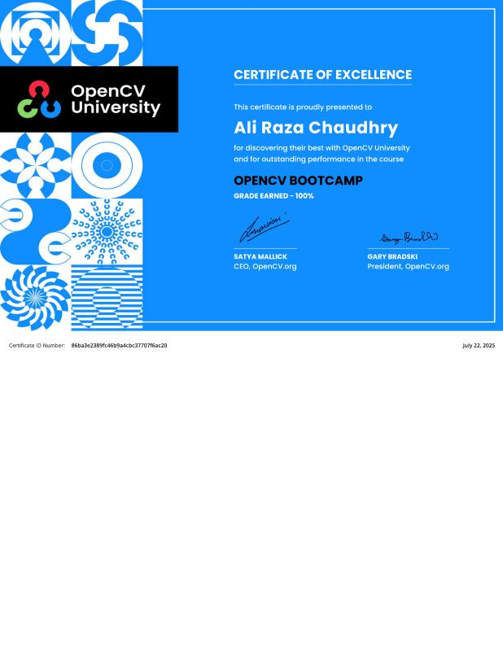
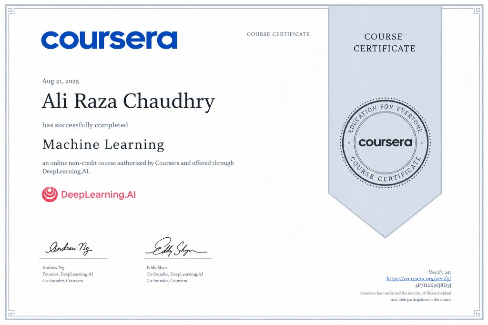
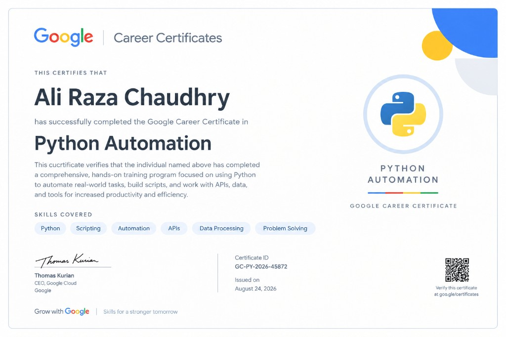
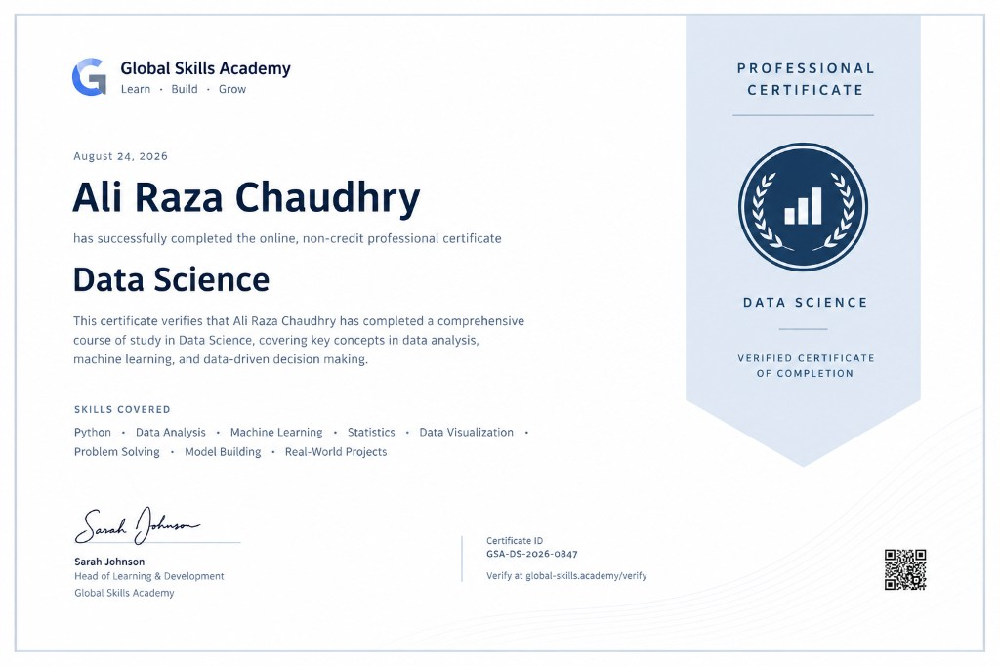
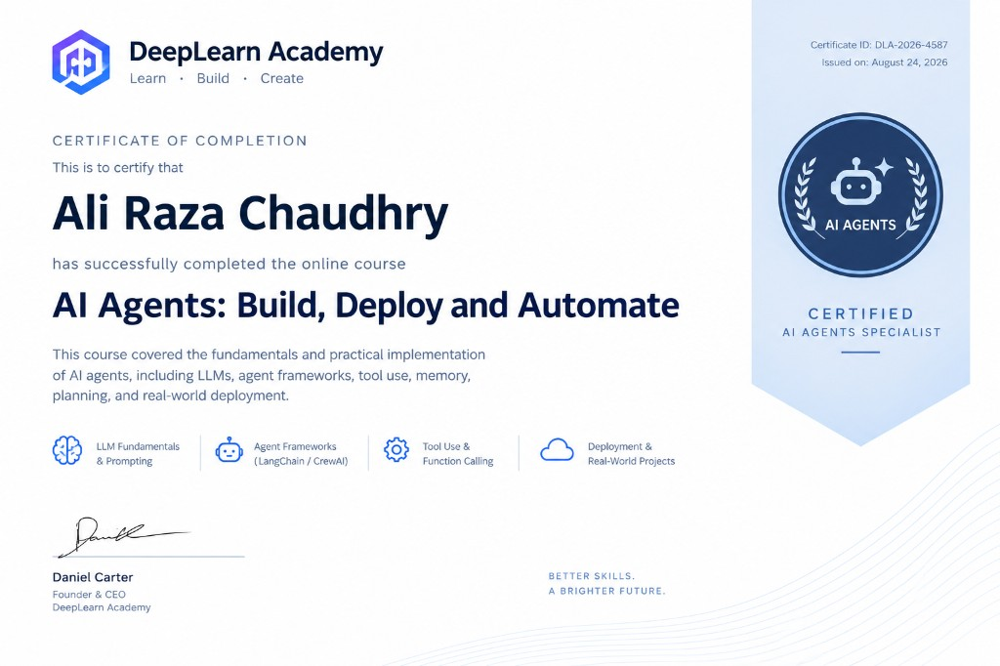
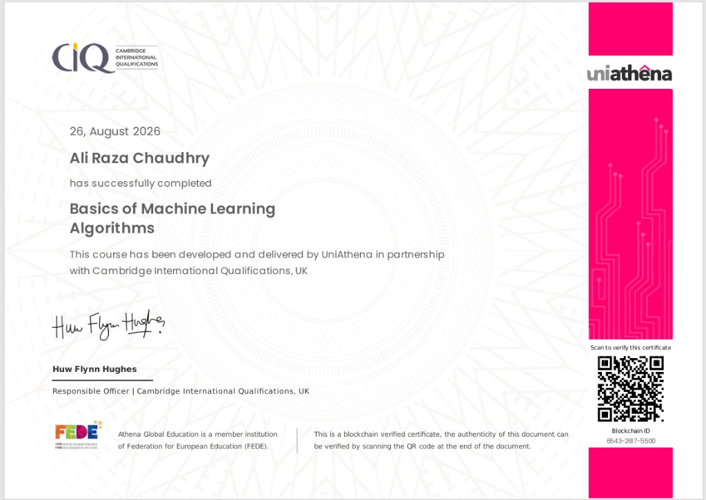
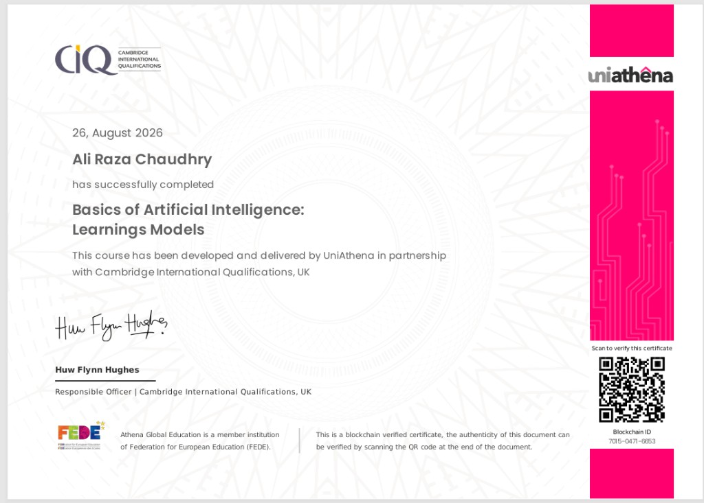
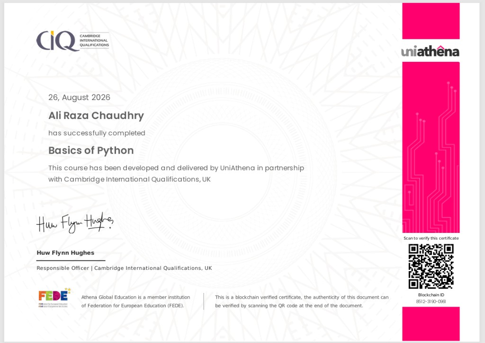

<!--
  GitHub Profile README — Ali Raza Chaudhry (@alirazach476)
  Synced with Ali_Raza_Chaudhry_CV
-->

### AI/ML Engineer · Data Scientist · Computer Vision · Generative AI · Full Stack Developer

🇵🇰 **Pakistan** &nbsp;·&nbsp;
📧 [alirazach1003@gmail.com](mailto:alirazach1003@gmail.com) &nbsp;·&nbsp;
📱 +92 322 6085459 &nbsp;·&nbsp;
🔗 [LinkedIn](https://www.linkedin.com/in/ali-raza-chaudhry) &nbsp;·&nbsp;
🐙 [GitHub](https://github.com/alirazach476)

 

---

## 🧭 Professional Summary

AI/ML Engineer and Data Scientist with hands-on experience in **machine learning, deep learning, computer vision, data analytics, statistical modeling, and generative AI**.

I build **end-to-end solutions** across data preparation, exploratory & statistical analysis, model development, evaluation, optimization, and deployment — with a focus on **scalable, production-ready AI systems** that deliver measurable business impact.

**Core stack:** Python · PyTorch · TensorFlow · OpenCV · YOLO · R · SQL · LLMs · RAG · AI Agents · FastAPI · React · Next.js · Node.js

---

## 💼 Experience

### Freelance Computer Vision Engineer · Self-Employed / Fiverr
**2025 – Present**
- Built **YOLO-based CV solutions** with **FastAPI** deployment
- Developed a **golf swing tracking system** using pose estimation to analyze swing angles and tempo for coaching feedback

### Embedded Systems Intern · Meta Desk Global · Lahore, Pakistan
**July 2025 – July 2026**
- Worked on **AI/ML, Data Science, Computer Vision, and NLP** — data preprocessing, model development, evaluation, and optimization
- Contributed to microcontroller programming, circuit interfacing, and hardware debugging

---

## 📊 Profile Dashboard

&nbsp;

  

  

---

## 🚀 Featured Projects

### 👁️ Computer Vision · Sports & Real-Time Analytics

| Project | Highlights |
|:--------|:-----------|
| [**UFC-Analysis**](https://github.com/alirazach476/UFC-Analysis) | Custom **YOLOv11** fighter tracking + action detection (punches, kicks, grappling, stance) with pose estimation & React dashboard |
| [**Cricket-AI**](https://github.com/alirazach476/Cricket-AI) | **YOLOv8 + OpenCV** player/ball detection, field mapping, shot & possession analysis, pitch maps, highlight generation |
| [**Smart-Football-Analysis**](https://github.com/alirazach476/Smart-Football-Analysis) | Player/ball tracking, team classification, bird’s-eye view, speed, heatmaps, pass/event detection |
| [**AI-GOLF-Skeleton**](https://github.com/alirazach476/AI-GOLF-Skeleton) | MediaPipe pose (30+ FPS), 3D avatar meshes (Trimesh/Open3D), coach-correction blending, FastAPI |
| [**ai-baseball-swing-analyzer**](https://github.com/alirazach476/ai-baseball-swing-analyzer) | MediaPipe + OpenCV/YOLO swing performance analyzer |
| [**Smart-Vehicle-Access-System-LPD-VMMR**](https://github.com/alirazach476/Smart-Vehicle-Access-System-LPD-VMMR) | **FYP** — license plate detection + VMMR for automated gate access · [Live demo](https://automated-gate-access.vercel.app) |

### 🛒 Detection · Billing · Industry CV

| Project | Highlights |
|:--------|:-----------|
| [**medicine-detection**](https://github.com/alirazach476/medicine-detection) | YOLOv11 + AI Smart Pharmacy billing |
| [**RetailAI**](https://github.com/alirazach476/RetailAI) / Product scanning & billing | Vision-based retail checkout automation |
| [**vehicle-damage**](https://github.com/alirazach476/vehicle-damage) · [**vehicle-damage-billing**](https://github.com/alirazach476/vehicle-damage-billing) | Damage localization + automated cost estimation (ONNX) |
| [**Multi-Person-Tracking**](https://github.com/alirazach476/Multi-Person-Tracking) | YOLOv8 + DeepSORT multi-object tracking |
| [**mechanical-tools**](https://github.com/alirazach476/mechanical-tools) | Real-time tools detection |
| [**furniture-classification-ml**](https://github.com/alirazach476/furniture-classification-ml) | Furniture visual classification |
| [**weapon-detection-billing**](https://github.com/alirazach476/weapon-detection-billing) | YOLOv8 + FastAPI + React billing dashboard |

### 🤖 Generative AI · Agents · RAG

| Project | Stack | What it does |
|:--------|:------|:-------------|
| [**rag-document-qa-agent**](https://github.com/alirazach476/rag-document-qa-agent) | LangChain · FAISS · OpenAI | Grounded document Q&A with citations |
| [**langchain-multi-tool-agent**](https://github.com/alirazach476/langchain-multi-tool-agent) | LangChain · LangGraph | Multi-tool agent (search, calculator, datetime) |
| [**langgraph-research-workflow**](https://github.com/alirazach476/langgraph-research-workflow) | LangGraph | Plan → research → critique → report |
| [**llm-customer-support-agent**](https://github.com/alirazach476/llm-customer-support-agent) | LLM · LangGraph | Intent routing, KB replies, tickets |
| [**multi-agent-knowledge-system**](https://github.com/alirazach476/multi-agent-knowledge-system) | Multi-agent · RAG | Supervisor + researcher + analyst + writer |
| [**AI-PDF-RAG**](https://github.com/alirazach476/AI-PDF-RAG) | RAG | PDF/document chatbot |

### 🧠 Machine Learning · Stats · Analytics

| Project | Focus |
|:--------|:------|
| [**fraud-detection-ml**](https://github.com/alirazach476/fraud-detection-ml) | Credit-card fraud detection (Random Forest + Streamlit) |
| [**skin-cancer-classification-ml**](https://github.com/alirazach476/skin-cancer-classification-ml) | Educational lesion classifier *(not medical use)* |
| [**Crop-Prediction**](https://github.com/alirazach476/Crop-Prediction) | ML crop prediction for farmers |
| [**Time-Series-Analysis**](https://github.com/alirazach476/Time-Series-Analysis) | ARIMA/SARIMA wholesale price modeling |
| [**Bayesian-analysis**](https://github.com/alirazach476/Bayesian-analysis) | Bayesian probability, posterior estimation, hypothesis testing |
| [**weather_detection**](https://github.com/alirazach476/weather_detection) | Weather detection with CNN |

### 🌐 Full-Stack Products (Selected Live Sites)

| Product | Stack | Link |
|:--------|:------|:-----|
| Crown and Dial | React | [crown-and-dial.netlify.app](https://crown-and-dial.netlify.app) |
| Fine Crafted Structures | Next.js / React | [constractioncompany.netlify.app](https://constractioncompany.netlify.app) · [finecraftedstructures.netlify.app](https://finecraftedstructures.netlify.app) |
| Healthy Start NEMT | WordPress/PHP | [healthystartnc.com](https://healthystartnc.com) |
| Nyuton Enterprises | WordPress/PHP | [nyutonenterprises.com](https://nyutonenterprises.com) |
| Stepping Stones CRI | React | [steppingstoness.netlify.app](https://steppingstoness.netlify.app) |
| Revara Real Estate | Next.js | [hotel-web-chi-tan.vercel.app](https://hotel-web-chi-tan.vercel.app) |
| NFT Marketplace | React | [nftmarketplaece.netlify.app](https://nftmarketplaece.netlify.app) |
| Clipzy | Next.js · Node · AI APIs | [clipzy.xynovix.com](https://clipzy.xynovix.com) |
| FamLink | Family care platform | [famlink.care](https://famlink.care) |
| Luxury Watch Store | Next.js · React | [watchs-gray.vercel.app](https://watchs-gray.vercel.app) |
| Smart Vehicle Gate (FYP) | CV + Web | [automated-gate-access.vercel.app](https://automated-gate-access.vercel.app) |

---

## 🧰 Technical Skills

| Area | Skills |
|:-----|:-------|
| **Computer Vision** | OpenCV, MediaPipe, YOLOv8/v11, RF-DETR, Object Detection, Classification, Segmentation, MOT, OCR, Real-Time Pipelines |
| **Machine Learning** | Supervised/Unsupervised, RF, XGBoost, LightGBM, SVM, KNN, Ensemble, PCA, Feature Selection, Model Evaluation |
| **Deep Learning** | PyTorch, TensorFlow, Keras, CNNs, RNNs, LSTMs, GANs, Transfer Learning, Attention, Transformers |
| **Generative AI & LLMs** | Prompt Engineering, RAG, Vector DBs, Embeddings, AI Agents, LangChain, LangGraph, Hugging Face, Fine-Tuning |
| **Data Science** | EDA, Cleaning, Feature Engineering, Predictive Analytics, Visualization, Experiment Tracking |
| **Statistics** | Hypothesis Testing, ANOVA, Bayesian Analysis, A/B Testing, Regression, Confidence Intervals |
| **Analytics Tools** | R, RStudio, Stata, Jupyter, Power BI, Tableau, Excel |
| **Python Libraries** | NumPy, Pandas, SciPy, Statsmodels, Scikit-learn, Matplotlib, Seaborn, Plotly |
| **Backend** | Python 3.9+, FastAPI, Node.js, Express.js, REST APIs, Webhooks |
| **Frontend** | React, Next.js, HTML, CSS, Tailwind, Bootstrap |
| **Databases** | SQL, PostgreSQL, SQL Server, MySQL, MongoDB |
| **Cloud & DevOps** | AWS, Docker, Kubernetes, CI/CD, Linux, Git, GitHub |

  

---

## 🎓 Education

**Bachelor of Computer Engineering**  
COMSATS University, Lahore  · *June 2026*

---

## 🏅 Certifications & Achievements

| Certificate | Issuer | Date | Credential |
|:------------|:-------|:-----|:-----------|
| **OpenCV Bootcamp** — Certificate of Excellence (100%) | OpenCV University | Jul 22, 2025 | `86ba3e2389fc46b9a4cbc37707f6ac20` |
| **Machine Learning** | Coursera · DeepLearning.AI (Andrew Ng) | Aug 21, 2025 | [Verify](https://coursera.org/verify/4F7H2K9Q8D3J) · `4F7H2K9Q8D3J` |
| **Python Automation** | Google Career Certificates | Aug 24, 2026 | `GC-PY-2026-45872` |
| **Professional Certificate in Data Science** | Global Skills Academy | Aug 24, 2026 | `GSA-DS-2026-0847` |
| **AI Agents: Build, Deploy and Automate** | DeepLearn Academy | Aug 24, 2026 | `DLA-2026-4587` · Certified AI Agents Specialist |
| **Basics of Machine Learning Algorithms** | UniAthena · CIQ UK | Aug 26, 2026 | Blockchain `6543-2617-5500` |
| **Basics of Artificial Intelligence: Learning Models** | UniAthena · CIQ UK | Aug 26, 2026 | Blockchain `7015-0471-6653` |
| **Basics of Python** | UniAthena · CIQ UK | Aug 26, 2026 | Blockchain `8512-3190-0961` |

### 📜 Certificate Gallery

  
  &nbsp;
  

  
  &nbsp;
  

  
  &nbsp;
  

  
  &nbsp;
  

---

## 🏆 Trophy Case

---

## 🤝 Let’s Connect

 

⭐ Open to roles and collaborations in **AI/ML Engineering, Computer Vision, Generative AI / Agents, and Full-Stack AI products**.

---

### ✨ Building scalable, data-driven, production-ready AI systems

